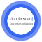

#  CodeScan **flow**ground Connector

## Description

A generated **flow**ground connector for the CodeScan API (version 1.0.0).

Generated from: https://api.apis.guru/v2/specs/code-scan.com/1.0.0/swagger.json 
Generated at: 2019-05-07T17:40:06+03:00

## API Description

Manage your Hosted CodeScan Service

## Authorization

Supported authorization schemes:
- Basic Authentication

## Actions

### Get the status of a job

> Fetches the status of a job

#### Input Parameters
* `jobId` - _required_ - Id of the Job to retrieve

### Queues a job

> Creates a new job

## License

**flow**ground :- Telekom iPaaS / code-scan-com-connector 
Copyright © 2019, [Deutsche Telekom AG](https://www.telekom.de) 
contact: flowground@telekom.de

All files of this connector are licensed under the Apache 2.0 License. For details
see the file LICENSE on the toplevel directory.
